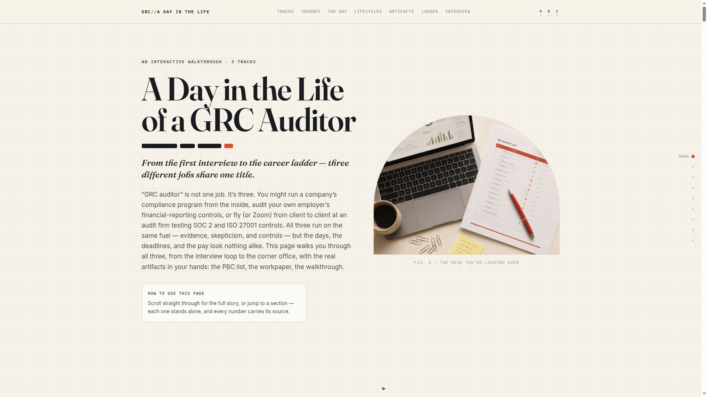
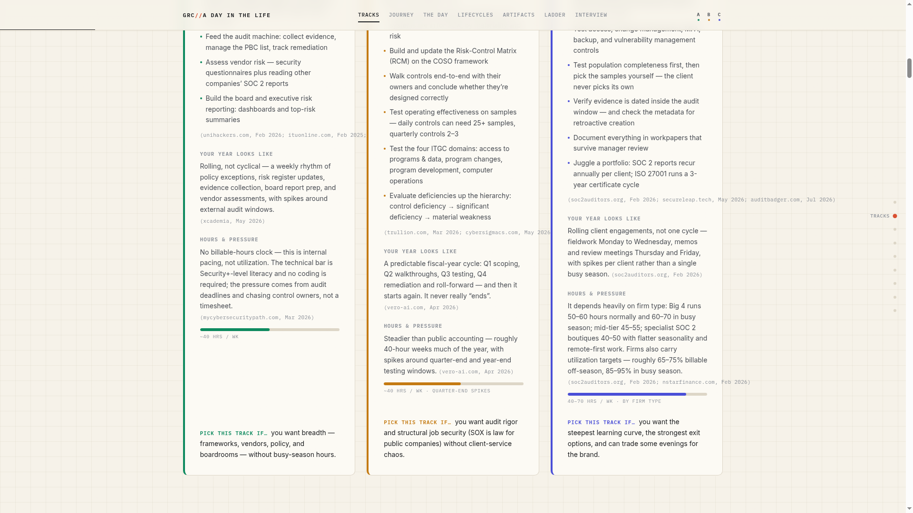
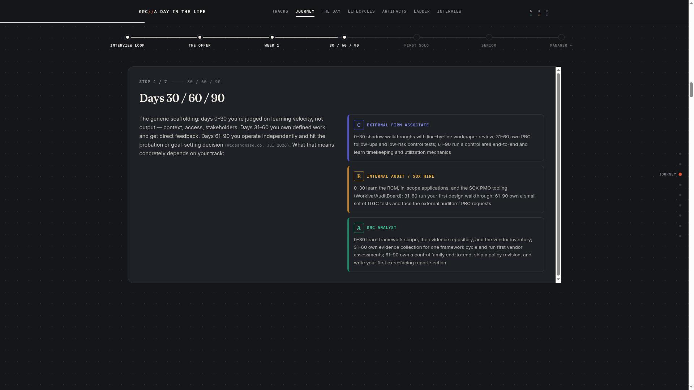
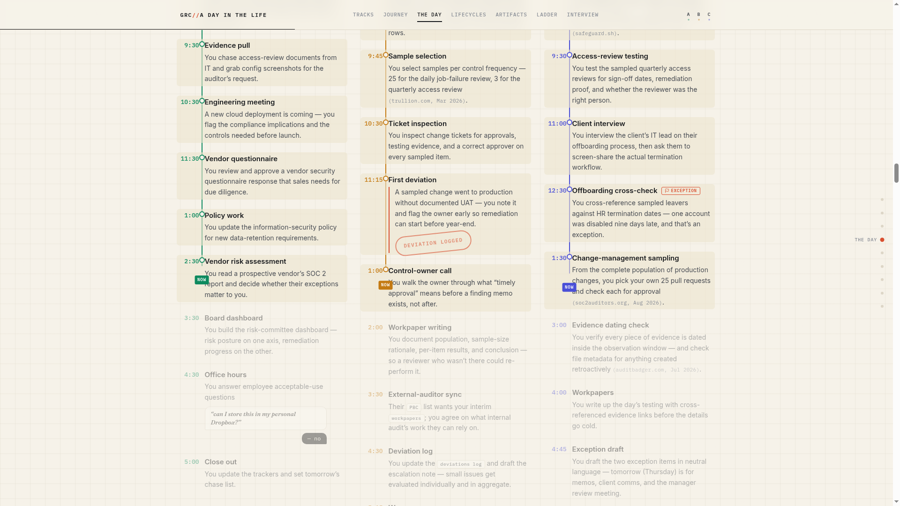
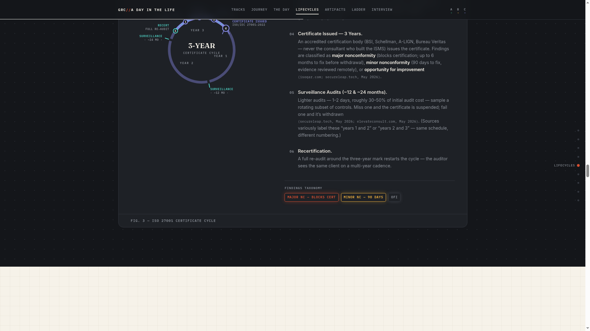
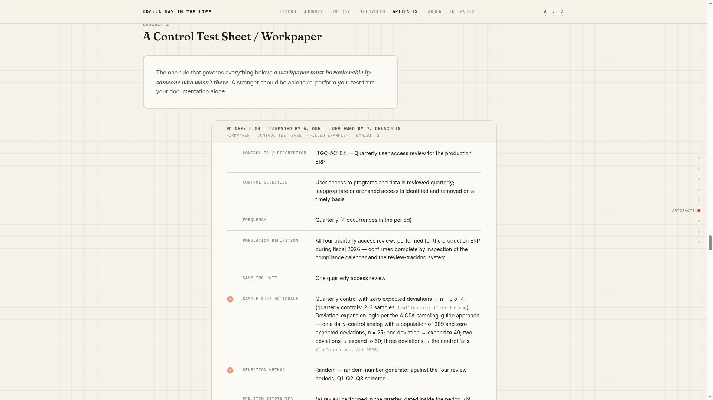
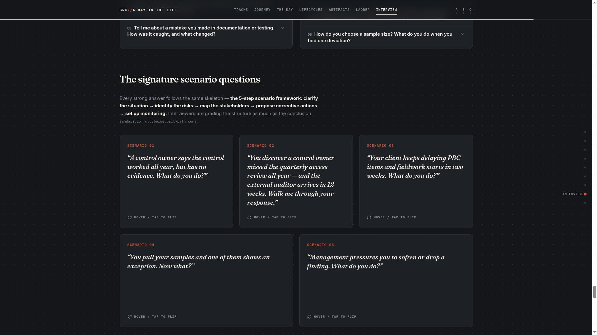

# A Day in the Life of a GRC Auditor

> An interactive, scroll-driven web experience that walks through the entire career of a Governance, Risk & Compliance (GRC) auditor — from the interview loop to the career ladder — across all three real-world tracks: in-house GRC analyst, internal audit / SOX (ITGC), and external audit (SOC 2 & ISO 27001).

**Live demo:** (https://github.com/kleckie7/grc-auditor-day-in-the-life)




---

## Why this project exists

"GRC auditor" is not one job — it's three genuinely different careers that share one title, and most people (including recruiters) confuse them. This site answers, in one long scroll:

- **What does the job actually look like day to day?** Hour-by-hour timelines for each track, with a scroll-scrubbed "NOW" marker traveling all three days simultaneously.
- **What happens from the time of hire?** A pinned, scroll-driven 7-stop journey: interview loop → offer (with sourced salary data) → Week 1 → days 30/60/90 → first solo engagement → senior → manager and beyond.
- **When does the work "end"?** Three animated lifecycle diagrams — the SOX fiscal-year loop that never ends, the SOC 2 engagement cycle with annual renewals, and the ISO 27001 three-year certificate ring with surveillance audits.
- **What does the work product look like?** Real artifacts, recreated faithfully: a filterable PBC (Provided-By-Client) request list, an annotated control test sheet / workpaper (with real sampling and deviation-expansion logic), and a step-through walkthrough trace from ticket to production.
- **How do you get hired?** The industry-standard interview process by employer type (Big 4 campus, Big 4 experienced, corporate internal audit, boutique SOC 2 firms), a 16-question bank, five flip-card scenario questions with "what a strong answer sounds like," and an interactive prep checklist.

## Screenshots

| Three tracks, side by side | Scroll-driven journey stepper | Three days, three timelines |
|---|---|---|
|  |  |  |

| ISO 27001 certificate cycle | Workpaper exhibit | Scenario flip cards |
|---|---|---|
|  |  |  |

## Highlights

- **Design concept — "The Living Workpaper":** the site itself is styled as an auditor's dossier — graph paper, ink typography, monospace evidence tags, status pills, red exception marks, sticky-note margin annotations, and sign-off stamps.
- **Consistent three-track color coding** (emerald / amber / indigo) threads through every section, so the side-by-side comparison is visible at a glance everywhere.
- **Scroll storytelling:** GSAP ScrollTrigger pinned sections, SVG `stroke-dashoffset` path-draw diagrams tied to scroll progress, character-level headline reveals, Lenis smooth scrolling.
- **Interaction everywhere:** filterable/sortable PBC grid, hotspot-annotated workpaper, walkthrough trace player, certification "subway map," flip cards, and a localStorage-persisted interview prep checklist.
- **Accessibility & performance:** `prefers-reduced-motion` fallbacks for every animation, keyboard-operable cards/tooltips/diagrams, aria-labeled SVG figures.
- **Sourced content:** every salary figure, certification cost, and framework fact carries an inline source tag. Content was compiled from 2024–2026 sources including AICPA (TSP Section 100), ISACA, ISO/IEC 27001:2022, IIA, PCAOB AS 2201, BLS OEWS, Glassdoor, and salary.com.

## Tech stack

| Layer | Choice |
|---|---|
| Framework | React 19 + TypeScript |
| Build | Vite 7 |
| Styling | Tailwind CSS 3.4 + shadcn/ui primitives |
| Scroll animation | GSAP 3 + ScrollTrigger + SplitText |
| Micro-interactions | Framer Motion |
| Smooth scroll | Lenis |
| Type | Fraunces (display) · Inter (body) · IBM Plex Mono (artifacts) |

## Getting started

```bash
npm install
npm run dev      # local dev server
npm run build    # production build → dist/
```

## Project structure

```
src/
├── components/        # Shared design system (Navbar, Footer, EvidenceChip,
│                      #  StatusPill, Stamp, StickyNote, DiagramFrame, ...)
├── sections/          # One component per story section
│   ├── Hero.tsx           # animated three-way fork diagram
│   ├── Tracks.tsx         # side-by-side track comparison cards
│   ├── journey/           # pinned 7-stop scroll stepper
│   ├── day/               # three synchronized hour-by-hour timelines
│   ├── lifecycles/        # SOX loop / SOC 2 line / ISO ring SVG diagrams
│   ├── artifacts/         # PBC grid, workpaper, walkthrough player
│   ├── ladder/            # career staircase + certification subway map
│   └── interview/         # loop tabs, question bank, scenario flip cards
└── lib/               # Track metadata, Lenis/scroll context
```

## Content & methodology

The copy was researched against primary framework sources (AICPA Trust Services Criteria, ISO/IEC 27001:2022 & 17021-1, PCAOB AS 2201, IIA standards) and current (2024–2026) market data, with conflicting sources flagged and presented as ranges rather than false precision. The full research brief and page copy are versioned in this repo (`info.md`).

## License

MIT — see [LICENSE](LICENSE). Content is educational, not career, legal, or financial advice.

---

_Built as a portfolio piece: researched content strategy + design-system-driven React engineering + scroll-driven storytelling._
